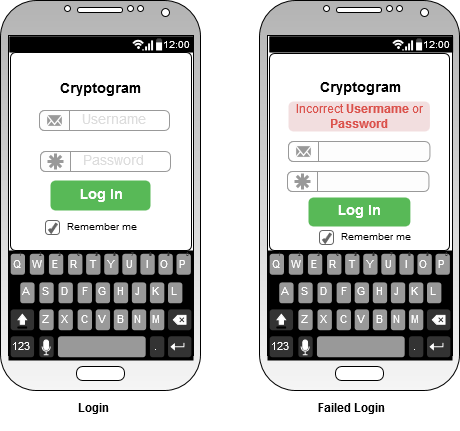
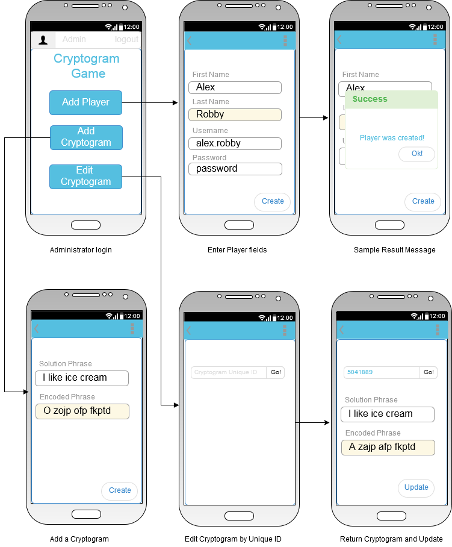
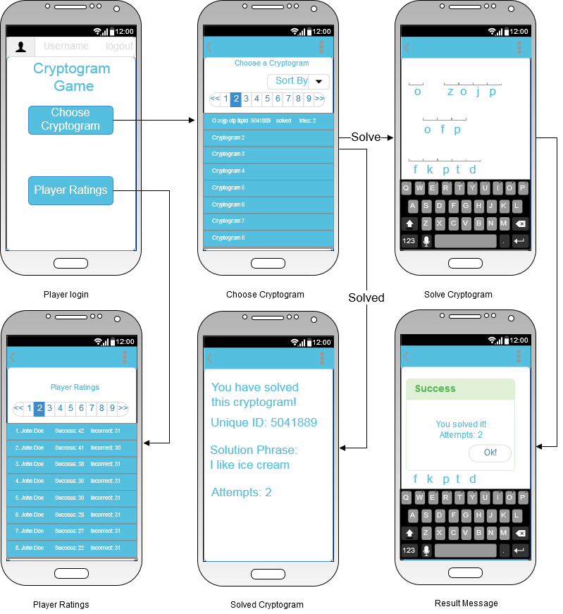
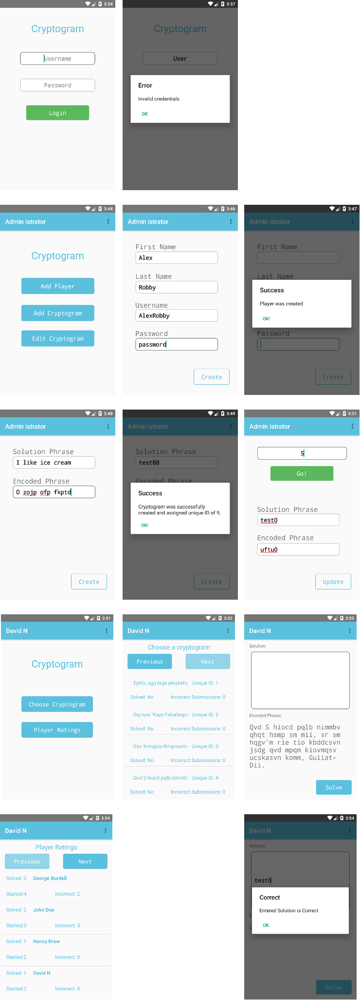

# Design Document

**Version**: 2.0 *(Updates to assumptions to reflect final design, addition of actual final product UI screenshots)* 
**Author**: Team 25

## 1 Design Considerations

### 1.1 Assumptions

* Version control will be handled using Georgia Tech’s GitHub.
* The app will be a client-server design and will depend on ExternalWebService to handle communication between the client and central server. 
* The app will use as a gradle dependency Bootstrap for Android to develop the majority of the front-facing view. 
* There will be basic authentication and unencrypted passwords.
* The app will use a fixed text-based, flat-file database that will be started on application startup.
* Development deliverables will be delivered in a timely manner.
* A waterfall approach will be used.
* Testing will cover all functionality of the application.
* Some pre-processing of cryptogram inputs may be necessary to ensure compatibility with database storage schemes and formatting.
* Player Ratings will be handled as follows: Cryptograms will be counted as "started" once the solution phrase entry field is populated with any text and before it is submitted. Cryptograms with incorrect submissions will continue to count toward started cryptograms, but those with correct submissions will be counted only as "solved" (and no longer as "started"). Incorrect submissions will be increased for each incorrect submission, including multiple incorrect submissions for the same cryptogram.
* It will not be necessary to create new administrators through the app user interface. An administrator account will be provided with credentials username: "admin" and password: Password" (without quotes).
* Credentials (both username and password) may be case-sensitive and contain only alphanumeric characters.
* It is acceptable to be able to edit previously created cryptogram solution and encoded phrases, even if the requirements do not explicitly state this.
* Only cryptograms in which every alphabetic character is shifted by the same number of positions in the alphabet (Caesar cipher or shift cipher) will be allowed when creating cryptograms. Additionally, cryptograms with same solution and encoded phrases (shift by 0 positions) will not be allowed.

### 1.2 Constraints

* The app will be coded using Java 1.8 in the IntelliJ Idea IDE as well as Android Studio 2.2. 
* Project resources may not be available at all times due to other commitments
* The project needs to be delivered within the specified timeline
* Technology is relatively new to the development team

### 1.3 System Environment

The app will operate under Android OS API version 19 or higher and will successfully display on typical phone screen resolutions and sizes

## 2 Architectural Design

### 2.1 Component Diagram

*Because our current design only includes at most three components, we believe it is not necessary to include a component diagram. The components are our local database, our application, and the web service that allows us to communicate with the central server.*

### 2.2 Deployment Diagram

*A deployment diagram is not necessary for this project because the objective is to deploy a relatively simple app on a mobile device.*

## 3 Low-Level Design

### 3.1 Class Diagram

### 3.2 Other Diagrams

*No additional diagrams are currently part of our project documentation, but some may be added as the design progresses.*

## 4 User Interface Design

### 4.1 Preliminary Mockups

**Login UI elements:**

  

**Administrator UI elements:**

  

**Player UI elements:**

 

### 4.2 Final Screenshots

  
