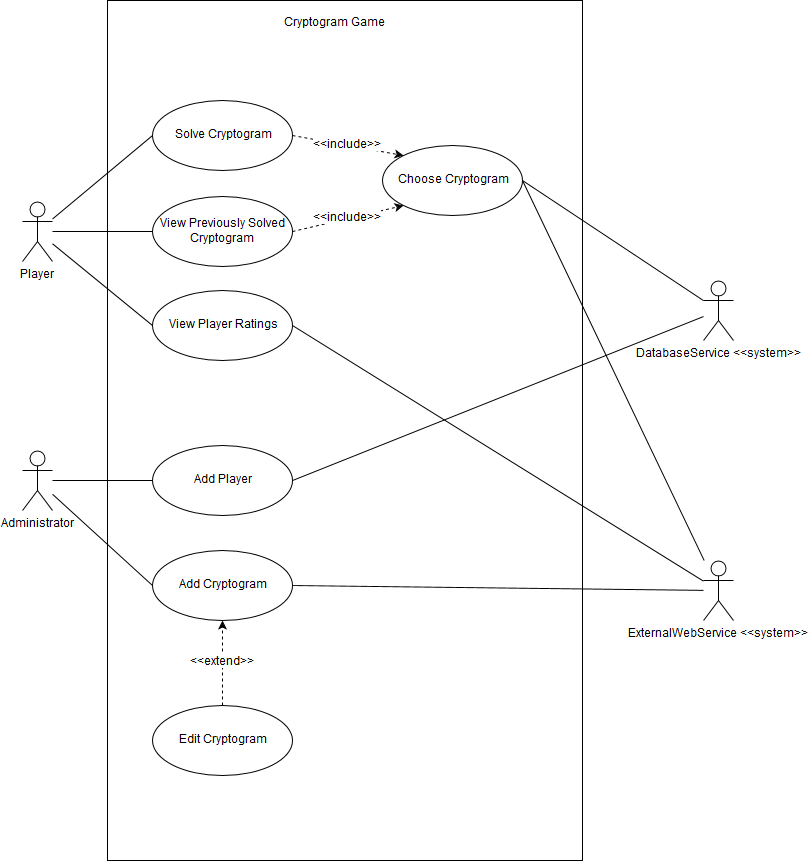

# Use Case Model

**Version**: 2.0 *(Some use cases updated with slightly different sequence of events)* 
**Author**: Team 25

## 1 Use Case Diagram

  

## 2 Use Case Descriptions

|   |   |
| --- | --- |
| _Name_ | Log In |
| _Requirements_ | Allow user to log in and view home screen |
| _Pre-conditions_ | User has launched application |
| _Post-conditions_ | User is logged in and viewing their user type-specific home screen |
| _Scenario_ | 1. User enters their unique username and password 2. Username and password is verified against local database 3. If credentials are valid, user is logged in 4. ExternalWebService used to sync local and remote databases of cryptograms and users 5. If user is an administrator, then administrator home screen displayed 6. If a user is a player, then player home screen displayed |

 

|   |   |
| --- | --- |
| _Name_ | Choose Cryptogram |
| _Requirements_ | Allow player to view a particular cryptogram |
| _Pre-conditions_ | Player is viewing a home screen|
| _Post-conditions_ | Player is viewing a particular cryptogram screen |
| _Scenario_ |1. Player touches button to choose cryptogram 2. Updated list of all cryptograms is displayed on screen for user to browse, including those not started, started, or previously solved by the user 3. Player touches a particular cryptogram to indicate their selection 4. Cryptogram screen is displayed 5. If player touches back button, player is returned to cryptogram list|

 

|   |   |
| --- | --- |
| _Name_ | Solve Cryptogram |
| _Requirements_ | Allow player to assign or reassign replacement letters to encrypted letters and view effects on cryptogram phrase |
| _Pre-conditions_ | Player completed &lt;Choose Cryptogram&gt; and viewing unsolved cryptogram |
| _Post-conditions_ | Player has assigned or reassigned replacement letters and either saved or submitted solution |
| _Scenario_ |1. Relevant data regarding the selected cryptogram is loaded from local database [solution in progress &amp; number of incorrect submissions, if applicable] 2. Player modifies solution phrase to reflect their guess 3. If player selects Solve, current solution is checked against key 4. If solution is correct, player rating is updated 5. If solution is incorrect, player incorrect submission count is increased 6. Player is notified of result and returned to cryptogram screen 7. If player touches back button, player is returned to cryptogram list|

 

|   |   |
| --- | --- |
| _Name_ | View Previously Solved Cryptogram |
| _Requirements_ | Allow player to see a previously solved cryptogram&#39;s details |
| _Pre-conditions_ | Player completed &lt;Choose Cryptogram&gt; and viewing cryptogram with previous correct solution by user |
| _Post-conditions_ | Player is able to view a solved cryptogram&#39;s encoded and decoded phrase as well as the correct substitution alphabet |
| _Scenario_ |1. Relevant data regarding the selected cryptogram is loaded from local database [solution &amp; number of incorrect submissions] 2. Player views the details of the solved cryptogram that they are interested in 3. If player touches back button, player is returned to cryptogram list|

 

|   |   |
| --- | --- |
| _Name_ | View Player Ratings |
| _Requirements_ | Allows player to see a list of player ratings |
| _Pre-conditions_ | Player is viewing a home screen |
| _Post-conditions_ | Player is able to view a list of player ratings including name, number of cryptograms solved, number of cryptograms started, and total number of incorrect solutions submitted for all local and remote players, sorted in descending order by number of cryptograms solved |
| _Scenario_ |1. Player touches button to view player ratings 2. List of player ratings is displayed on screen for user to browse. Remote player scores were updated when app was launched, local user scores are updated live. 3. If player touches back button, player is returned to cryptogram list|

 

|   |   |
| --- | --- |
| _Name_ | Add Player |
| _Requirements_ | Allows administrator to add a new user to database |
| _Pre-conditions_ | Administrator is viewing administrator home page |
| _Post-conditions_ | A new user with unique username and other attributes is added to the local database |
| _Scenario_ |1. Administrator touches button to add player 2. A data entry form is displayed that allows the administrator to input a first name, last name, password, and username 3. Administrator touches Create button to add the new user data 4. The app checks that the user information meets all requirements and restrictions and if it does adds the new user to the system 5. A confirmation message is displayed 6. If administrator touches back button, administrator is returned to the home screen|

 

|   |   |
| --- | --- |
| _Name_ | Add Cryptogram |
| _Requirements_ | Allows administrator to add a new cryptogram |
| _Pre-conditions_ | Administrator is viewing administrator home page |
| _Post-conditions_ | A new cryptogram with all required attributes is added to the central server |
| _Scenario_ |1. Administrator touches button to add cryptogram 2. A data entry form is displayed that allows the administrator to input a solution phrase and encoded phrase. 3. If the administrator selects Create, ExternalWebService checks that the phrases are valid and if so adds the cryptogram to the central server and assigns it a unique identifier. 4. A confirmation message is displayed 5. Administrator is returned to home screen|

 

|   | |
| --- | --- |
| _Name_ | Edit Cryptogram |
| _Requirements_ | Allows administrator to update a previously added cryptogram |
| _Pre-conditions_ | Administrator is viewing administrator home page |
| _Post-conditions_ | An existing cryptogram&#39;s solution phrase or encoded phrase is updated |
| _Scenario_ |1. Administrator touches button to edit cryptogram 2. An entry box allows administrator to enter the Unique ID of the cryptogram they wish to edit 3. If administrator enters a particular cryptogram and touches Go! button, that cryptogram&#39;s current solution and encoded phrases are displayed 4. The administrator can change either phrase as desired 5. If the administrator selects Update, ExternalWebService checks that the phrases are valid and if so edits the cryptogram on the central server 6. A confirmation message is displayed 7. If the administrator touches back button, administrator is returned to home screen|

