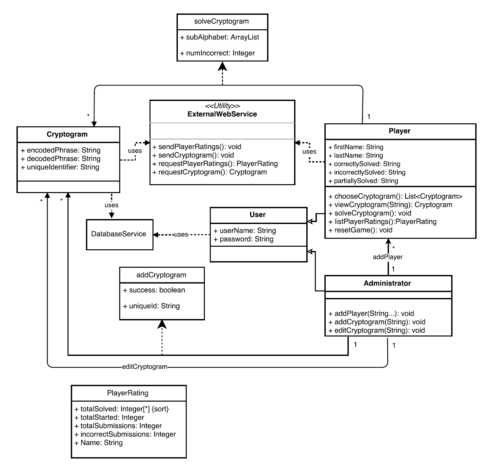

# Individual Designs

## Design 1

One of this diagram's pros is that it includes a superclass User above Player and Administrator subclasses to collect common attributes. However, the diagram also includes an Application class and this may be uncessary for conveying the requirements of the design. This class also includes attributes that were not specifically mentioned in the requirements. Similarly, some other classes also contain attributes that are redundant and could be queried and derived from attributes already stored outside those classes. For example, within the Cryptogram class the attributes gramSolvedBy and gramStartedBy are attributes that could be calculated when needed from the Solve association class. Another pro is that the database is represented in the design by the ApplicationDatabase class, which is good for showing relationships with other classes. However, a con is that this class may contain too much information that is not necessary for this level of design. The database may be better modeled as a black box within the context of this diagram. Finally, information about cardinality of relationships added a good level of detail, but the diagram was missing information about the inputs to operations which may similarly add good detail without producing too much clutter.

## Design 2

This design is by Alexander Molnar (amolnar6). Some of the strengths of this diagram were that is clear and well organized. It had the User super class with the login() method and Administrator and Player as subclasses. We decided that it probably made more sense to move Username attribute to User since an Administrator would have this also. The diagram followed the requirements very closely and did not add any additional or unncessary classes, though some of the methods could have had clearer names. The diagram did include some method inputs and outputs though which will help down the road for the actual implementation. The diagram did not have a database class, which, though absolutely necessary, we decided to incude in the final design since it helps to have it documented. The relationships included cardinality which made sense and were accurate. We did decide though that the externalWebService utiliy class should have more detail such as being connected to the Administrator class.

## Design 3

This design is by Michael Amadasun (mamadasun3). Through the discussion with the team there were a few items that were right and some that could have been handled a lot better. To start with some positives, the design was very detailed to the point where it was including getter and setter methods for some of the classes. This could be a positive because it gives a good understanding of what the program is going to look like when it is built out. Another positive was that the diagram had defined the database as a black box which was to be used by multiple classes in the program. This minimized a part of the document that could be quite complex if fully drawn out. In terms of the negative design aspects, the positives was also a negative. Although having a detailed UML could be good in some cases, sometimes simpler is better. There were a lot of areas where there were additional classes that could have been coalesced into one class while keeping the same level of functionality. The diagram was also missing some key items such as the cardinality and also the proper terminology and associaton between two classes.

## Design 4

This design is by Muzammil Mueen Butt (mbutt9). The major advantages of this design were its approach to keep things concise, and avoiding diagram to get cluttered, while not leaving out any details. The functionality of similar components, for instance listing, viewing &amp; selecting cryptograms were combined into single methods instead of separate methods, which keeps the diagram clearer and easy for the software engineer to process and program.

This design handles its classes in a graceful and concise way by declaring attributes and methods only when necessary, while avoiding any duplicates. The relationship between classes is also kept simple. Design of some of the tricky parts like database and external web service are kept simple and we used these components in our final design too. Similarly, the process of solving cryptograms and adding cryptograms were also simple by adding association class and we implemented it in our final design as well. Handling player ratings was also straight forward by declaring a separate data structure which can be used to get player ratings in a sorted fashion. We also included this component in our final design.

During our team discussion, we discussed majorly about the absence of login functionality in this design. The player and admins are kept separate and the system here can let anyone simply select to be admin or a player. In the final design, we added a super class &#39;User&#39; which is parent to both player and administrator class and holds information like username and role, along with login functionality. Though not explicitly mentioned in requirements, we deemed login functionality essential for a real system.

The UML design shown above was created by Isaac Silva. One of the main highlight for this design is that it is very clean and very well organized. The design avoids extra cluttering by including most of the design requirements within four modules. Design also uses a combination of getter and setter methods encompassing good programming practice. Concise explanation of each connection is another useful feature of the design.

As an entry point to the application, the designer uses a 'User' class by including most of the essential design requirements such as creating a new player, viewing player statistics, maintaining game progress, solved game list, etc. Similarly, the 'Game' class, quite aptly, handles everything pertaining to the word scramble game as well as the statistics. The external web service utility also appropriately addresses the design requirements.

On the other hand, the UML did not include any underlying database, which seems to be necessary for the application. Although, the design in less cluttered with minimal modules, however, to make the design more easy to implement a few additional modules addressing specific tasks such as dedicated module to statistics, creating a new player, etc would have been more appropriate from implementation point of view.

The design presented above was created by Mukul Pai. This design expresses cardinality quite apprpriately between the 'User' and the 'Player' and then between the 'Player' and the 'Scramble' classes. Another highlight of the design is that object oriented approach is clearly defined between the 'Scramble' class and associated classes 'NewScramble', 'ProgressScramble', etc & then between the 'Statistics' class and 'PlayerStatistics' and 'ScrambleStatistics' classes.

Similar to the rest of the team members, the design uses a 'User' class as an entry point to the application handling all the information that is required to create a new player. Along with that, the Scramble class and its associated classes clearly separated and address all what was required as part of the design requirements. This can be very positive in the sense that it provides better understanding of what the application implementation approach should be like.

On the contrary, above mentioned aspects of the design are sort of positive as well as negative. That is having a more detailed UML design can be very apt in some cases, however, a more simpler design could have been more appropriate as some of the additional classes could have been engulfed into the parent classes. Another thing not present in the diagram was an underlying database to handle player, scramble and statistical information. 

# Team Design

As a team, we set up a call to go through each requirement and review the pros and cons of each of our designs. Through our discussion we were able to come to the conclusion on the above UML design. We agreed that there needed to be some form of login for a player and administrator. This led us to the creating a user class which will be the entry to the program. This class will store the username and password information and redirect to giving the user either admin or player rights based on their credentials. We agreed upon this design as there needed to be a way to differentiate between not only players in the system, but also between a player and an administrator.

In the scenario that a user logged in with administrator rights we all agreed to the functionality an admin will have in the system which were to: 1)Add a player 2) Add a cryptogram 3) Edit a cryptogram. This would be built out within the administrator class and in order for these operations to occur there had to be a relationship between Administrator and Player, and between Administrator and Cryptogram. The relationship between the Administrator and the Player was simple enough to just add a new player entry. However, between the Administrator and the Cryptogram was more involved and an area of discussion amongst the team. We could either make a straight call to cryptogram for both the edit and the add however, if we used this approach where would the result message and the generated unique ID reside. It could have been on either the Cryptogram class or the helper class of addCryptogram. We agreed to use the helper addCryptogram class for the addCryptogram method for the admin. What is not shown here as we did not believe it had a large impact on the design was the cryptogram validation. This we decided would occur within the administrator method addCryptogram. Though not all individual designs included the same functionality, the team design incorporated a simple “edits” association and included a separate editCryptogram operation within Administrator to signify that the administrator should be able to edit any cryptogram at any time, not just at the time they submit a new one. The association between Player and Cryptogram was commonly agreed to be “solves” with the choosing and viewing of cryptograms implied by that simple relationship.

In the scenario that a user logged in as a player to the system they will be brought to the Player class in which we all agreed should contain the values of the users first name and last name. There was some discussion on whether these values should reside on the user level but we did not believe that the administrator needed to have these values. As a player in the system, the user shall be able to: 1)View a list of Cryptograms 2) Choose a cryptogram to solve 3) Solve the cryptogram 4) View a list of player ratings. In order to handle these scenarios we have 4 methods which will do these exact requirements. viewCryptogram is a method which will request the uniqueID of the cryptogram that the user would like to solve. chooseCryptogram will display a list to the user in which the user can choose any of the cryptograms to view. solveCryptogram is where the player will begin to play the game and we will begin subroutines in order to keep track of metrics such as if the cryptogram was solved or not. This will tie into the utility class of PlayerRating that will store for each player the attributes which will be passed back to the method in the player class named listPlayerRatings. The player class will be tied to the database service in order to update this information once a player begins work on a cryptogram

The Cryptogram class will be used to store information on the cryptogram such as the encoded and decoded phrase for a cryptogram. Some team members included additional attributes such as a list of users who had correctly solved a particular cryptogram, but it was determined that such a list could be derived from the Player class and the relationship between Player and Cryptogram. There was also agreement that the Administrator class should not need any attributes but should include addPlayer and addCryptogram operations, in addition to the editCryptogram operation discussed earlier.

Once a cryptogram is added or edited, the cryptogram will communicate to the database so that any further requests to the cryptogram will be updated accordingly. Regarding the local database, all but one user’s individual diagram included a class entity to represent this component in the design. Two of the three users who included it left it as a complete “black box” while one user tried to add some details about the data structures that would be stored there. It was decided that there does not need to be a lot of detail about the database in this UML class diagram, so it was left as a simple class with no attributes or operations. A “uses” dependency was established between the DatabaseService and the User superclass as well as Cryptogram. Similarly, three team members included some kind of class structure to handle player ratings. It was decided we should have a class representing the collection of attributes belonging to a player such as totalSolved, totalStarted, and so on.

We discussed the ExternalWebService utility class and how exactly it will communicate with our system. We deemed that it should essentially be a gateway to an external server. As a result, this class will simply pass information about by using the methods sendPlayerRatings, sendCryptogram, requestPlayerRatings, and requestCryptogram.

# Summary
The general process of teamwork that we found useful for getting started was to first create a review spreadsheet and give each member time to review the other members' diagrams individually. Each member would use this spreadsheet to record their comments and thoughts for each requirement individually and for the design as a whole. We found that this process left us better prepared to discuss the designs as a group and to try to come to an agreement on a team design. Through this individual review and then group discussion, it was somewhat easier to begin to see the design from the different perspectives that exist within a group and for each member to recognize the strengths and weaknesses of their individual design. That being said, as we went through the process of building out our design we noticed that there were quite a few corrections and observations that we addressed along the way. These steps could possibly be mitigated by making sure we completely understand and analyze each requirement before starting work on the design. By comparing and contrasting our individual designs we realized that, for UML diagrams, there is a fine balance between putting too much and too little detail. As a result, we tried to clearly portray each of the components with future implementation in mind without over complicating the design and making the diagram unreadable or confusing.
