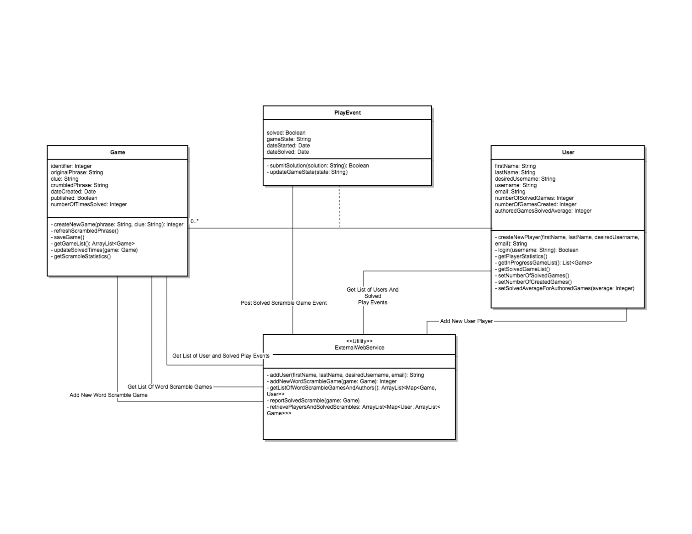
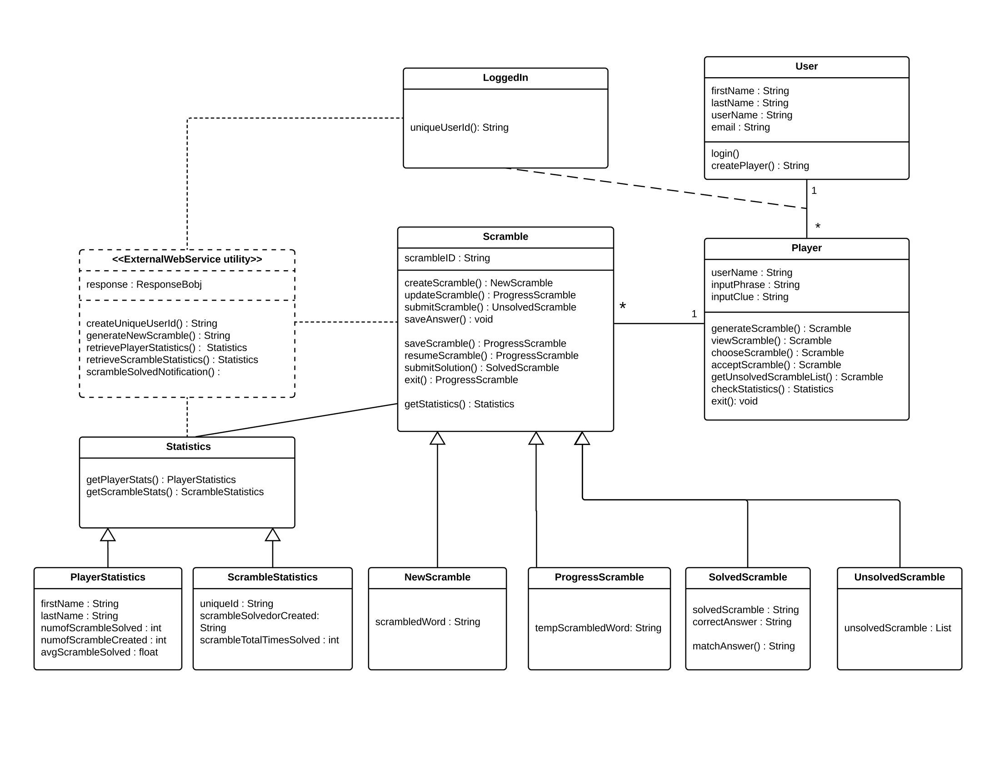
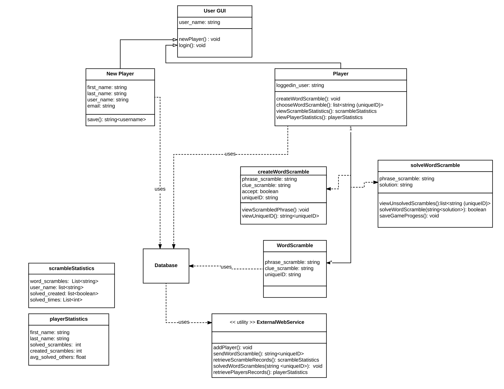
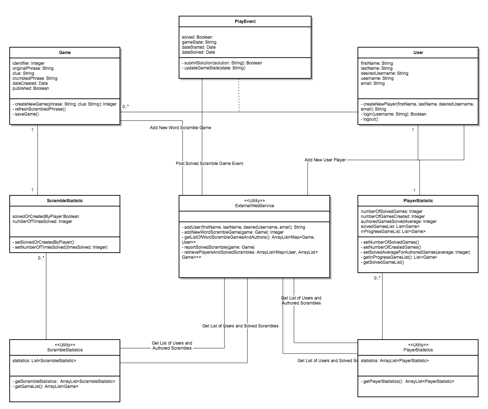

# CS6300 SDP Fall 2017 - Group Project
by Isaac Silva (```isilva6@gatech.edu```), Mukul Pai (```mpai8@gatech.edu```) & Saad Khan (```skhan315@gatech.edu```)

## Word Scramble Game

## Individual Designs

### Design 1



The UML design shown above was created by Isaac Silva. One of the main highlights for this design is that it is very clean and very well organized. The design has excellent portrayal of the overall system to be implemented which made it very easy to visualize the overall design of the system. The design avoids extra cluttering by including most of the design requirements within four modules and also incorporates all the functional requirements needed by the system. Class components described in the UML are consistent i.e all components accurately display class specific attributes and functions. Design also uses a combination of getter and setter methods encompassing good programming practice. Interaction between the components are showcased explicitly by providing concise explanation of each connection.

As an entry point to the application, the designer uses a 'User' class by including most of the essential design requirements such as creating a new player, viewing player statistics, maintaining game progress, solved game list, etc. Similarly, the 'Game' class, quite aptly, handles everything pertaining to the word scramble game as well as the statistics. The external web service utility also appropriately addresses the design requirements.

While the design covers everything that is required, it does not include any underlying database, which according to the designer, seems to be unnecessary for the model. Although, the design in less cluttered with minimal modules, however, to make the design easier to implement a few additional modules addressing specific tasks such as dedicated module to statistics, creating a new player, etc would have been more appropriate from implementation point of view. Never the less, the design makes a lot of sense overall and is used as the basis for teh final team design. 


### Design 2



The design presented above was created by Mukul Pai. Including a 'Statistics' class to encapsulate the logic of how to get statistics is one the main postives of this design. This design also expresses cardinality quite appropriately between the 'User' and the 'Player' and then between the 'Player' and the 'Scramble' classes. Another highlight of the design is that object oriented approach is clearly defined between the 'Scramble' class and associated classes 'NewScramble', 'ProgressScramble', etc & then between the 'Statistics' class and 'PlayerStatistics' and 'ScrambleStatistics' classes.

Similar to the rest of the team members, the design uses a 'User' class as an entry point to the application handling all the information that is required to create a new player. Along with that, the Scramble class and its associated classes clearly separated, addressing all what was required as part of the design requirements, however, the return data types for few of the methods were not that explicit, specifically the statistics object returned by few methods do not mentioned the returned data types.

The design having more detailed UML design can be very apt in some cases, however, a more simpler design could have been more appropriate as some of the additional classes could have been engulfed into the parent classes such as the 'Loggedin' feature and scramble (in-progress, completed). Another feaure not present in the diagram was an underlying database to handle player, scramble and statistical information.


### Design 3



This design was generated by Saad Khan. From the user point of view, this application design excellently covers all the different components that are to be involved in the application with accurate interactions and flow. Good design principles were followed to showcase attributes of each component along with their functionalities. This design also had similarities with another team member's design in terms of the appraoch taken to include statistics class (playerStatistics, scrambleStatistics) and also having multiple instances of the word scramble.

In comparison to rest of the individual member design, the application design begins a user class, where the user has a choice of either choosing to login if his/her user profile is already in the system otherwise just choose to enter as new player in order to land onto a new player profile creation page/activity. This way the design for the UI point of view seems less cluttered, however, a more simpler approch could have been to encompass it as an instance of the player class rather keeping it as a separate class. 

The design also includes an underlying database (providing connectivity between the external web service (EWS) and rest of the modules), which during team discussion was considered a feature that could have been excluded from the UML and this way the EWS, a centralized utility, could have been connected in a way to be accessed by all other components in the system. Overall nice job but there seem to be quite a few class and the design coudl have been simplified in certain cases such as 'createWordScramble' class could have been an instance of the 'wordScramble' class while 'solveWordScramble' class could aslo have been described a method for the 'wordScramble' class.


## Team Design


As a collective team effort, we setup multiple calls to visit various requirements of the design and reviewed pros and cons for each individual design. The disscussions were thorough which led to the final UML deisgn as shown above. The team was in unanimous agreement that the application's entry point should be the 'User' class also evident in all the individual UML designs. It was decided that the 'User' class will give the option to the user to either create a new user profile by accepting user credentials such as first name, last name, email, user_id, etc or login if the profile is already in the system. This approach led to an agreement amongst team members on how to distinguish between new and existing players.


## Summary

Main objective of coming together as a team for the final design was to get individual as well as collective team feedback which turned out to be quite useful. At the beginning, a review word document was shared amongst the team members in between successive team meetings. This way, each team member was able to perform first draft of the review based on other team member's design. This left each team member and the team collectively in a better position to address the do's and don’ts for the final design and by the time the team got together to discuss the final design each member had a clear idea of what was to go into the final design.

The whole experience of team work highlighted both theoretical and industrial practices of software development process. This approach and the feedback from within the team also helped each team member to review the capabilities of their own individual design. Building the final design was an iterative process with the team observing and mitigating possible design shortcomings along the way.

The team also took a fresh approach by re-visiting the requirements for assignment 5. Although, the final design was a version of one of the team member's design, re-visiting the requirements helped the team address the task at hand in a much better way. Finally, when compiling the team design, members put extra effort to make it precisely while clearly portraying what was required of it without making it too intricate.
